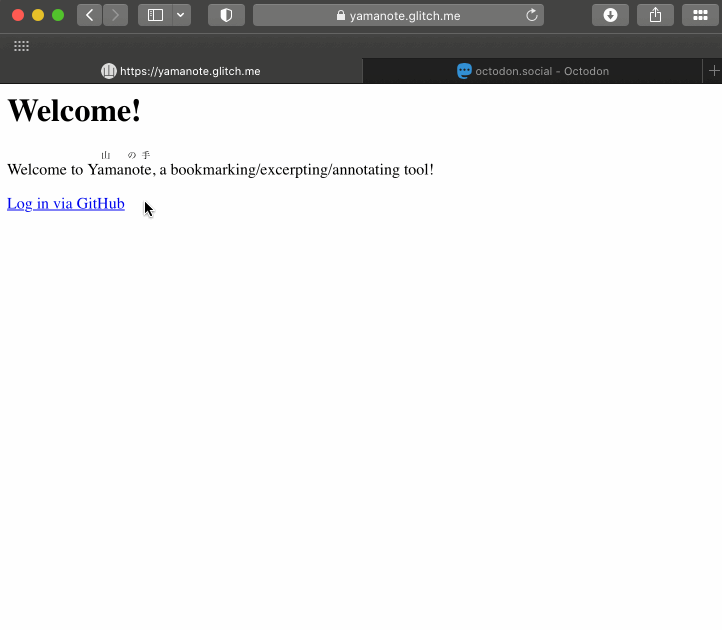

# <ruby>Yama<rt>山</rt></ruby><ruby>no<rt>の</rt></ruby><ruby>te<rt>手</rt></ruby>

Closed server: https://yamanote.glitch.me. For an invite, [contact](https://fasiha.github.io/#contact) me or open an [issue](https://github.com/fasiha/yamanote/issues)!

See [Setup](#setup) instructions below for easy deploy to Glitch or your own server!

## Introduction

> I don’t know if all people are aware that if you write for the media regularly, you *forget* what you write the second you write it, because you’re on to the next thing. And a *lot* of people forget what you write the second you write it because they’re on to reading the next thing. —[“The Pandemic’s Effect on Language”](https://www.booksmartstudios.org/p/the-pandemics-effect-on-language), *Lexicon Valley* podcast, September 22, 2021 (18:30).

I read a lot of stuff online.

And I very frequently I tend to return to what I read, days, weeks, months later, often to cite it, often to check on some detail, often because it’s suddenly become more important to me.

In the last few years I came to rely on three overlapping tools to help me with the daily flurry of blog posts, tweets, toots, podcasts, and books:

1. social media (initially Twitter, then Mastodon),
2. journaling app (I use Day One on iOS and macOS), and
3. Pinboard, the bookmarking/backup service by the most entertaining [Maciej Cegłowski](https://twitter.com/Pinboard), complemented with the Pins app on iOS.

All three of these do much more than helping me keep track of my reading and so I didn’t really notice until recently that none of them satisfied my very specific needs. As I was making the following table, the desiderata and tradeoffs and missing features became obvious:

| feature | social media | journal app | Pinboard | Yamanote |
|---------|--------------|-------------|----------|----------|
| full archive | ❌ | ❌ | ✅-ish (breaks on Twitter, paywalls) | ✅-ish |
| browser archive | ❌ (screenshot doesn’t count) | ❌ | ❌ |  ✅ |
| images in comments | ✅ | ✅ | ❌ | (WIP) |
| no pagination | ❌ (Mastodon paginates toots, Twitter paginates threads) | ❌ (read one entry at a time) | ❌ | ✅ |
| Markdown | ❌ (Mastodon per instance via plugin) | ✅ | ❌ | (WIP) |
| individually time-stamped updates | ✅ | ❌ | ❌ | ✅ |
| mark things as public/private | ~ (Mastodon ok, Twitter nah) | ✅ | ✅ | (WIP: all private now) |
| shareable links | ✅ | ❌ | ✅ (to logged-in users) | (WIP) |
| randos can’t reply | ❌ (Mastodon ok) | ✅ | ✅ | ✅ |

## Features

So here’s what it looks like these days, about three weeks after development started:

And here’s a prose description of the above: Yamanote is
- a bookmarklet-based bookmarking web app.
- It’s a web application so you need to run it on a computer, or get a friend to run it for you. (Technical notes: Node.js, SQLite.)
- When you decide you want to bookmark a page on the web, you click on a Yamanote bookmarklet in your browser’s bookmarks bar (works great on desktop, and in Safari on iOS) to tell the Yamanote server about it.
- Any text you’ve selected will be added as a “comment” to the bookmark by Yamanote. This is fun because as you read, you can select interesting snippets and keep clicking the bookmarklet to build a personalized list of excerpts.
- You can add additional commentary to the bookmark in Yamanote, either by editing one of the excerpts made from the bookmarklet or an entirely new comment with its own timestamp.
- Also, the first time you bookmark a URL, your browser will snapshot the entire webpage and send it to the Yamanote server as an archive (in technical terms, it’ll serialize the DOM). This is great for (1) paywalled content you had to log in to read, (2) Twitter, which makes it hard for things like Pinboard to archive, etc.
- The *server* will download any images—and optionally videos—in your bookmarked sites.
- You can browse Yamanote’s snapshot of the URL (it might look weird because we block custom JavaScript in the mirror and lots of sites these days look weird with just HTML and CSS—shocking I know).
- You can “sign into” Yamanote using your GitHub login (I do not want your nasty passwords). You can configure the server to only allow a certain approved list of GitHub users to log in.
- Nobody except you can see your bookmarks, comments, or archives. (We’ll eventually relax this by letting you share temporary links with your friends.)
- And there are probably more quirky features not listed above.

*Caveat* This is a very personalized tool! The above list of features and anti-features and non-features is quirky because I’m quirky—sorry!

## Usage

- 🔗 gives you a permalink to this bookmark
- 💌 lets to add a new comment to this bookmark, **or** to edit an existing comment. The timestamp of each comment is a permalink
- 💁 shows you your Yamanote archive of the webpage. It might look really weird 😢, Twitter for example looks like crap unless you do some DOM manipulation.
    - Twitter looks ok once you delete all SVGs: `Array.from(document.querySelectorAll('svg')).concat(Array.from(document.querySelectorAll('img')).filter(o=>o?.src.endsWith('svg')) ).forEach(o=>o.remove())`
    - This is served with a very locked-down Content Security Policy so your browser will *not* go outside Yamanote to fetch JavaScript or any assets.
- 💥 takes you to *just* this bookmark, where you can *delete* it 😱. There’s *no undelete button* yet, **but** a backup will be created so with a little bit of programming your bookmark (and comments and backups) all can come back.

## Setup

Below we detail two different ways to set up your own personal Yamanote. Once that’s set up, the first time you open it, you’ll be invited to log in. The GIF below shows that login, where the bookmarklet is and one way to add it to your bookmarks bar, and finally an example of using it to make your first bookmark:

### Glitch

Glitch offers free and paid backends to run Node.js apps, with an in-browser code editor and terminal. To set up your very own Yamanote instance on Glitch:

1. Remix the Glitch Yamanote: https://glitch.com/edit/#!/remix/yamanote
1. Make note of your new project name (or rename it). In the screenshot below, Glitch has named my remix “mercury-foul-snowdrop”
1. Register a [new GitHub OAuth app](https://docs.github.com/en/developers/apps/building-oauth-apps/creating-an-oauth-app)
    - Your answers to “Application name” and “Homepage URL” are not important
    - However **“Authorization callback URL”** is really important: set this to `https://<YOUR GLITCH PROJECT>.glitch.me/auth/github/callback`
    - So, taking the screenshot below as my example, I would use https://mercury-foul-snowdrop.glitch.me/auth/github/callback as my “Authorization callback URL”
1. Back in Glitch, open the `.env` file in the Gitch editor and populate each value
    - `GITHUB_CLIENT_ID` and `GITHUB_CLIENT_SECRET` come from GitHub when you register your new application above
    - `GITHUB_ID_ALLOWLIST` is a comma-separated list of numeric GitHub IDs that Yamanote will allow to log in. Nota bene, *this is not usernames* because GitHub allows you to change your username, which is a really nice and important feature. To find my numeric GitHub, for example, go to https://api.github.com/users/fasiha and look for the `id` field: you’ll see mine is 37649
    - `SESSION_SECRET` should be a long random string that the Express.js web server will use to encrypt session cookies. If you need inspiration, [open](https://webmasters.stackexchange.com/a/77337) your browser’s JavaScript Console and run the following to generate roughly [32](https://crypto.stackexchange.com/a/34866) random bytes: `Array.from(Array(16), _ => Math.random().toString(36).slice(2)).join('')`
    - `URL` is the *origin* part of the **“Authorization callback URL”** you gave GitHub, so for example, https://mercury-foul-snowdrop.glitch.me for the screenshot below
1. Glitch will soon restart your server. Go to `https://<YOUR GLITCH PROJECT>.glitch.me` and start using your Yamanote!

Nota bene: Glitch’s free plan will shut down servers after some inactivity. If that happens, and you bookmark something, it’ll take several seconds for Glitch to restart Yamanote. They do have a paid plan where you can “boost” apps to be always-on. My closed public server mentioned above, https://yamanote.glitch.me, is boosted and should always be on.

### Local

These are technical notes on how to set up Yamanote to run on a server, intended for someone comfortable with the Unix command line. I do hope to one day package this up as a Docker image for easy deployment, but I’m too busy reading your shitposts to do that right now.

1. Install [Git](https://git-scm.com/) and [Node.js](https://nodejs.org) (any recent version will be fine)
1. In your command line terminal (iTerm2 or xterm or Git Bash), clone this repository by running `git clone https://github.com/fasiha/yamanote.git`
1. Enter the new directory: run `cd yamanote`
1. Ask npm, the Node package manager, to install all dependencies: run `npm i`.
1. Register a [new GitHub OAuth app](https://docs.github.com/en/developers/apps/building-oauth-apps/creating-an-oauth-app). I know some of you feel ill at even the mention of Microsoft, but please try to control your drama, you need this just to log into Yamanote so it knows whose bookmarks are whose
    - Your answers to “Application name” and “Homepage URL” are not important, but **“Authorization callback URL” is really important**.
    - If you just want to use Yamanote on the same computer as it’s running on, you can use `http://localhost:3456/auth/github/callback`
    - If you want to use it on any computer in your home network, use `http://<YOUR COMPUTER'S LOCAL IP ADDRESS>:3456/auth/github/callback`. If you don’t know your computer’s local IP address, look up instructions for your operating system (on Linux and macOS, you can run `ifconfig`; on Windows I think you right-click something…?), or look at your router’s list of connected devices.
1. Create a new `.env` by copying the example: run `cp env.example .env`
1. Open `.env` in your favorite text editor and fill in the data it needs:
    - `GITHUB_CLIENT_ID` and `GITHUB_CLIENT_SECRET` come from GitHub when you register your new application above
    - `GITHUB_ID_ALLOWLIST` is a comma-separated list of numeric GitHub IDs that Yamanote will allow to log in. Nota bene, *this is not usernames* because GitHub allows you to change your username, which is a really nice and important feature. To find my numeric GitHub, for example, go to https://api.github.com/users/fasiha and look for the `id` field: you’ll see mine is 37649
    - `SESSION_SECRET` should be a long random string that the Express.js web server will use to encrypt session cookies. If you need inspiration, type in `node` to start the Node REPL and run the following to generate 32 random bytes and stringify them: `crypto.randomBytes(32).toString('base64url')`
    - `URL` is the *origin* part of the **“Authorization callback URL”** you gave GitHub, so just `http://localhost:3456` or `http://<YOUR COMPUTER'S LOCAL IP ADDRESS>:3456` or `https://<YOUR GLITCH PROJECT NAME>.glitch.me` or whatever
1. You’re finally ready to start the Yamanote server! Run `npm run serve`

Open http://localhost:3456 or `http://<YOUR COMPUTER'S LOCAL IP ADDRESS>:3456` in your browser and start using Yamanote! Refer to the GIF [above](#setup) to see the initial login, bookmarklet setup, and a first bookmark.

## Dev features

Random buzzwordy factoids about Yamanote~

- For a small number of users (one: me), it’s fast and I’m hoping it’ll stay fast thanks to
    1. conventional wisdom suggesting stock Node and Express are capable of serving 1k to 10k requests per second,
    1. [better-sqlite3](https://github.com/JoshuaWise/better-sqlite3/) being the high-performance SQLite bridge (apparently *because* it’s synchronous?),
    1. SQLite running in [write-ahead mode](https://github.com/JoshuaWise/better-sqlite3/blob/master/docs/performance.md),
    1. and Yamanote storing each user’s main page response in memory.
    1. (All that said, there are numerous speedups possible because I am a noob at SQL: we could prepare *all* our statements; some places I make two calls to the database instead of combining them.)
- Almost entirely TypeScript.
    - Uses Gary Bernhardt’s [static-path](https://github.com/garybernhardt/static-path) to typecheck Express.js routes and, in some places, uses [io-ts](https://github.com/gcanti/io-ts/blob/master/index.md#implemented-types--combinators) for runtime codecs.
    - The tiny part that isn’t TypeScript—the bookmarklet and the light JavaScript in the main Yamanote homepage—ought to be converted 😅, so we can ensure the frontend makes only valid requests to the backend.
- Built-in backups. There’s a database change-logging system based on [this neat strategy](https://www.budgetwithbuckets.com/es/blog/2018/08/27/sqlite-changelog.html/). It’s not yet exposed anywhere, but it isn’t purged either, so feel free to edit comments, delete things (directly via SQLite command line), etc., confident that you’ll be able to undo things, with a bit of SQL.
- Privacy-focused. The only thing Yamanote stores from all the info GitHub sends it is the numeric GitHub ID (not even your username) and the current display name if any.
    - I mean sure, the few times you try to log in without a cookie, Microsoft is going to know you’re accessing some app called Yamanote by some rando named @fasiha—which should be very infrequent since Yamanote cookies should never expire.
    - But yeah, if someone steals the database, they’ll know who was bookmarking leftist cringeprop, sorry.
    - And if you really want me to add another federated login, open an issue—Passport.js supports pretty much everything. Heck, I guess we could even add passwords (with salt and pbkdf2 and ugh this is why I don’t want to store your nasty passwords).
- This is more of a caveat: backing up all the CSS and images in a webpage can really use up disk space. For example, I noticed that the highest-resolution banner image for a New York Times story is *seven megabytes* ([this doodle](https://static01.nyt.com/images/2021/11/18/opinion/sunday/18tufekci/18tufekci-superJumbo.png) accompanying a [piece](https://www.nytimes.com/2021/11/18/opinion/covid-winter-risk.html) by the immortal Zeynep Tüfekçi). Please keep an eye on the size of your database. Managing archive size is another work in progress.
    - (Note that, in the above example, the “superJumbo.png” is in an `` tag’s [`srcset`](https://developer.mozilla.org/en-US/docs/Web/API/HTMLImageElement/srcset), so your browser wouldn’t download it unless it met a resolution criteria.)

## Upcoming features

Oh my gosh, there are so many features this desperately needs but right now, as of November-end 2021, I think Yamanote is at the MVP (minimum viable product) phase for my own personal use.

The MVP can be deployed to Glitch.com, which is a free Node.js service. As soon as I add support for Pandoc (for Markdown rendering) and youtube-dl (to download videos), Glitch won’t work and I’ll prepare a full Docker image.

There are some features not described above, like bearer token authentication, to use Yamanote from command-line apps, etc.

I am very open to feedback and feature requests and code contributions. If I know someone else is using this, I’ll try my best to package this up for more general consumption. Please [get in touch](https://fasiha.github.io/#contact) or open an [issue](https://github.com/fasiha/yamanote/issues) on GitHub.
